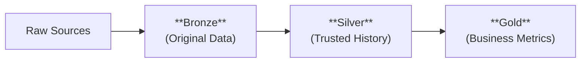

# Data Engineering Framework  

A flexible, production-ready data engineering framework designed to accelerate analytics by implementing the **medallion architecture** (bronze/silver/gold), while embedding quality, governance, and reusability at its core.

✅ **Self-serve analytics** with clear data layers
✅ **Built-in history tracking** for all key data
✅ **One-click deployments** for your team

```bash
git clone https://github.com/your-repo/data-engineering-framework.git
```

## Prerequisites

To run this framework effectively, you need access to a Databricks environment.

### Core Requirements
- ✅ Databricks workspace (with Unity Catalog recommended)
- ✅ Cluster with Delta Lake support (Databricks Runtime 11.3+ or similar)
- ✅ Access to a Unity Catalog or Hive Metastore
- ✅ Git integration configured (for code versioning)

## How the Data Flows


### Data Layers
| Layer      | Purpose                                             | Designed For             | Access           |
|------------|-----------------------------------------------------|--------------------------|------------------|
| **Bronze** | Preserves raw source data exactly as received       | Data Engineers           | 🔍 Metadata Only |
| **Silver** | Provides clean, reliable data with complete history | Data Scientists/Analysts | ✅ Read-Only     |
| **Gold**   | Delivers business-ready metrics and aggregates      | BI Tools/Applications    | ✏️ Read-Write    |

## Getting Started
### For Data Consumers
#### 1. Business Reporting (Gold Layer):
```sql
-- Daily metrics
SELECT * FROM gold.sales_metrics 
WHERE report_date = CURRENT_DATE
```

#### 2. Historical Analysis (Silver Layer):
```sql
-- Trend analysis
SELECT * FROM silver.customers
WHERE valid_year = 2023
```

#### 3. Data Lineage Checks:
```sql
DESCRIBE DETAIL bronze.sales
```

### For Data Engineers
#### Key Features
- 🛠️ Pre-configured pipeline templates
- 🔄 Automated SCD2 historization
- 🔒 Built-in access controls

